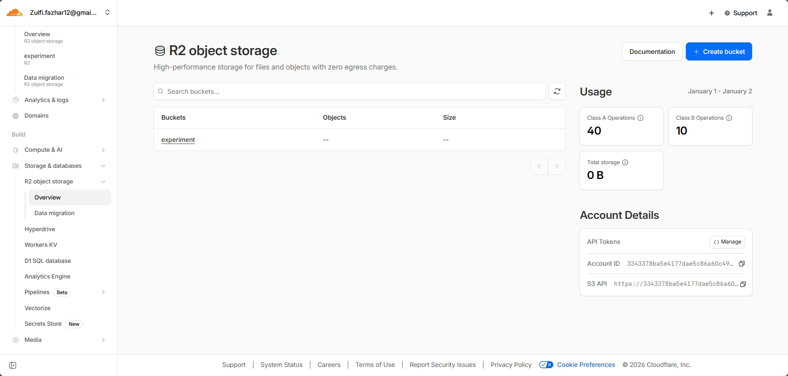
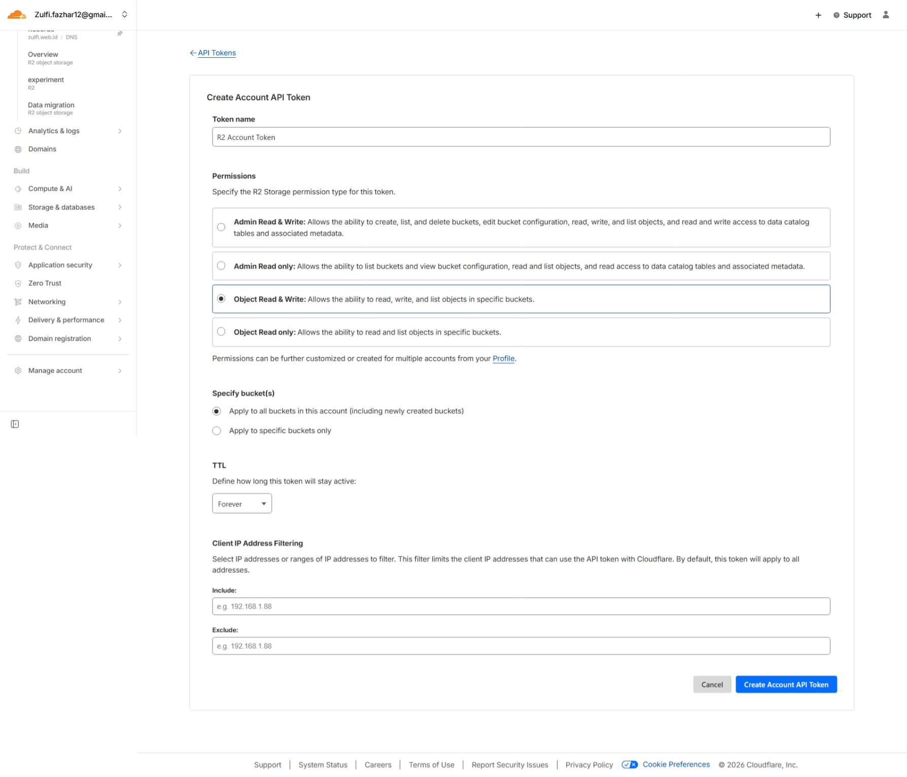
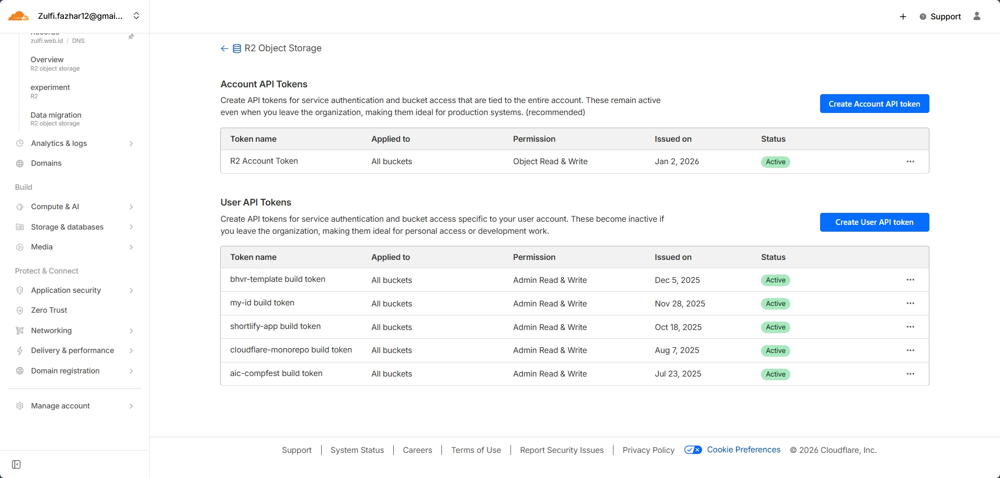

# Cloudflare R2 Storage - Experiment Project

Project eksperimen untuk operasi object storage menggunakan Cloudflare R2 dengan boto3 API.



## 📋 Deskripsi

Project ini adalah implementasi sederhana untuk berinteraksi dengan Cloudflare R2 Object Storage menggunakan boto3 (S3-compatible API). Fitur yang tersedia:

- ✅ Upload file ke R2
- ✅ Download file dari R2
- ✅ List semua file di bucket
- ✅ Generate presigned URL (link sementara untuk akses file private)

## 🔧 Prerequisites

- Python 3.10 atau lebih tinggi
- Akun Cloudflare dengan R2 enabled
- [uv](https://github.com/astral-sh/uv) package manager (atau bisa pakai pip)

## 🚀 Setup R2 Object Storage

### 1. Buat R2 Bucket

1. Login ke [Cloudflare Dashboard](https://dash.cloudflare.com)
2. Pilih **R2 Object Storage** dari sidebar
3. Klik **Create bucket**



4. Masukkan nama bucket (contoh: `experiment`)
5. Klik **Create bucket**

### 2. Dapatkan API Credentials

1. Di halaman R2, klik **Manage R2 API Tokens**
2. Klik **Create API token**



3. Konfigurasi token:
   - **Token name**: Berikan nama (contoh: `experiment-token`)
   - **Permissions**: Pilih **Object Read & Write**
   - **TTL**: Sesuaikan atau biarkan default
4. Klik **Create API Token**
5. **Simpan** credentials berikut (hanya muncul sekali!):
   - Access Key ID
   - Secret Access Key
6. **Account ID** bisa dilihat di URL dashboard atau di halaman R2 overview

## 📦 Instalasi

### Clone atau Download Project

```bash
git clone <repository-url>
cd r2-storage/experiment
```

### Install Dependencies

**Menggunakan uv (recommended):**

```bash
uv sync
```

**Atau menggunakan pip:**

```bash
pip install -r requirements.txt
# atau
pip install boto3 python-dotenv
```

## ⚙️ Konfigurasi

### 1. Copy File Environment

```bash
cp .env.example .env
```

### 2. Edit File `.env`

Buka file `.env` dan isi dengan credentials R2 Anda:

```env
R2_ACCOUNT_ID=your_account_id_here
R2_ACCESS_KEY_ID=your_access_key_here
R2_SECRET_ACCESS_KEY=your_secret_key_here
R2_BUCKET_NAME=your_bucket_name_here
```

## 🎯 Cara Menggunakan

### Jalankan Demo Script

```bash
python main.py
```

Script akan:

1. Membuat file test `test.txt`
2. Upload ke R2 dengan path `experiment/test-upload.txt`
3. Menampilkan daftar file di bucket
4. Generate presigned URL (berlaku 1 jam)
5. Download file kembali sebagai `downloaded_test.txt`
6. Cleanup file `test.txt`

### Menggunakan Fungsi Individual

```python
from main import upload_file, download_file, list_files, generate_presigned_url

# Upload file
upload_file("myfile.pdf", "documents/myfile.pdf")

# List semua file
list_files()

# Download file
download_file("documents/myfile.pdf", "downloaded_myfile.pdf")

# Generate link sementara (1 jam)
url = generate_presigned_url("documents/myfile.pdf")
print(url)

# Generate link dengan waktu custom (24 jam)
url = generate_presigned_url("documents/myfile.pdf", expiration=86400)
```

## 📁 Struktur Project

```
experiment/
├── main.py              # Script utama dengan semua fungsi R2
├── pyproject.toml       # Dependencies (uv format)
├── uv.lock             # Lock file dependencies
├── .env.example        # Template environment variables
├── .python-version     # Python 3.10+
├── public/             # Assets untuk dokumentasi
│   ├── overview.png
│   ├── create.png
│   └── manage.png
└── README.md           # Dokumentasi ini
```

## 🔍 Penjelasan Fungsi

### `get_r2_client()`

Membuat koneksi ke R2 menggunakan boto3 S3 client dengan endpoint Cloudflare.

### `upload_file(file_path, object_name)`

- `file_path`: Path file lokal yang akan diupload
- `object_name`: Nama/path file di R2 (bisa pakai prefix seperti `folder/file.txt`)

### `list_files()`

Menampilkan semua file di bucket beserta ukurannya.

### `download_file(object_name, download_path)`

- `object_name`: Path file di R2
- `download_path`: Path untuk menyimpan file hasil download

### `generate_presigned_url(object_name, expiration=3600)`

Membuat URL sementara untuk akses file private tanpa credentials.

- `object_name`: Path file di R2
- `expiration`: Durasi link valid (detik), default 1 jam

## 💡 Tips & Troubleshooting

### Error: "NoSuchBucket"

- Pastikan nama bucket di `.env` sesuai dengan bucket yang sudah dibuat
- Cek typo pada `R2_BUCKET_NAME`

### Error: "SignatureDoesNotMatch"

- Periksa kembali `R2_ACCESS_KEY_ID` dan `R2_SECRET_ACCESS_KEY`
- Pastikan tidak ada spasi atau karakter tambahan saat copy-paste

### Error: "Could not connect to the endpoint URL"

- Pastikan `R2_ACCOUNT_ID` benar
- Format endpoint harus: `https://{ACCOUNT_ID}.r2.cloudflarestorage.com`

### Presigned URL tidak bisa diakses

- Link presigned URL memiliki expiration time (default 1 jam)
- Untuk link lebih lama, tambahkan parameter `expiration` lebih besar

## 📚 Referensi

- [Cloudflare R2 Documentation](https://developers.cloudflare.com/r2/)
- [boto3 S3 Documentation](https://boto3.amazonaws.com/v1/documentation/api/latest/reference/services/s3.html)
- [R2 Pricing](https://www.cloudflare.com/products/r2/)

## 📝 License

Experiment project - bebas digunakan untuk pembelajaran.

---

**Happy coding! 🚀**
